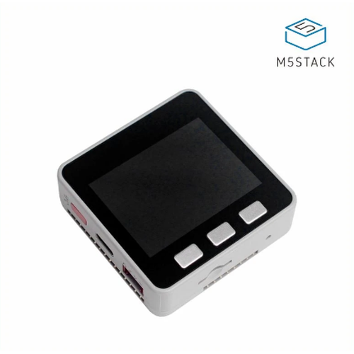
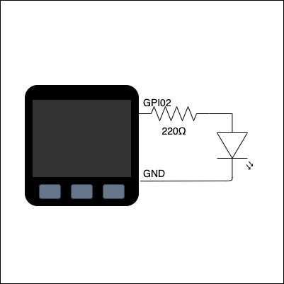
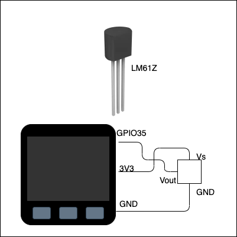
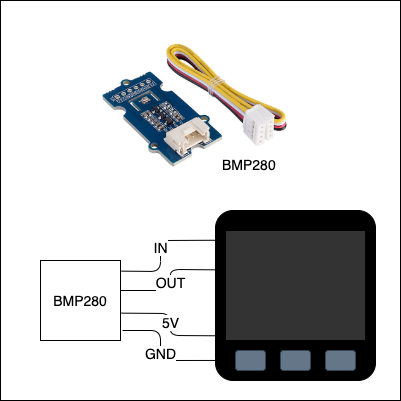
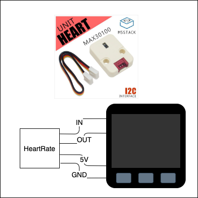
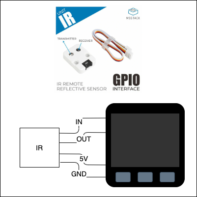

# M5Stackを使ってみた

---

## はじめに

- 本資料は個人使用を目的としています。
- サンプルプログラムは、動作実績のあるプログラムを紙面に合わせて変更しています。紙面のプログラムのままでは挙動しない場合があります。
- 本書で使っている機器やセンサは日本国内ではスイッチサイエンス社にて購入可能です。

---

## M5Stackとは



- 中国深圳のM5Stack社提供
- Arduino互換のマイコン
- ESP32(WiFi/BLE)を搭載
- SDカードスロット搭載
- USB TypeC搭載
- Groveコネクタ搭載
- カラーTFT LCD搭載
- 標準機は¥5,000程度

---

## シングルボードコンピュータ

- M5Stackは、シングルボードコンピュータの一種。
- シングルボードコンピュータとは、単一基盤で構成された自己完結型のコンピュータ
- シングルボードコンピュータには以下のようなものがある

| 製品 | 特徴 |
|:--|:--|
| Raspberry Pi | 英国製。元々は子供向けIT教育用途で開発。 |
| Arduino | 伊発祥。オープンソースのハードウェア。 |
| Jetson | NVIDA。人工知能処理を得意とする。 |

---

## "Raspberry Pi"と"M5Stack"の違い

| Arduino | Rspberry Pi|
|:--|:--|
| ハードウェア寄り | ソフトウェア寄り |
| 自由度は低いが、手軽に扱える | 自由度は高いが、とっつきにくい |
| ハードウェア性能は低め | ハードウェア性能は高め |
| OS搭載なし | RaspberryPiOS(Linux) |を標準搭載
| 開発環境はArduinoIDEで固定 | 開発環境は自由 |
| シングルタスク駆動 | マルチタスク駆動 |
| Simple is best | 安価な小型パソコン |

---

## Hello World


```cpp
#include <M5Stack.h>

void setup() {
  M5.begin();
  M5.Lcd.setTextSize(2);
  M5.Lcd.printf("Hello World from M5Stack");
}

void loop() {

}
```

---

## Lチカ



```cpp
#include <M5Stack.h>

#define LED_PIN 2

void setup() {
  M5.begin();
  pinMode(LED_PIN, OUTPUT);
}

void loop() {
  digitalWrite(LED_PIN, HIGH);
  delay(500);
  digitalWrite(LED_PIN, LOW);
  delay(500);
}
```

---

## アナログ温度センサ(Circuit Diagram)



LM61BIZという温度センサーを使って、温度を測ってみます。

LM61BIZでは、Voutピンに周囲の温度に応じた電圧が出力されます。

---

### アナログ温度センサー(Arduino)

```cpp
#define LM61BIZ_PIN 35
void setup() {
  M5.begin();
  M5.Lcd.setTextSize(4);
  pinMode(LM61BIZ_PIN, INPUT);
}
void loop() {
  int e = analogRead(LM61BIZ_PIN);
  float Vout = e / 4095.0 * 3.3 + 0.1132;
  float temp = (Vout - 0.6) / 0.01;
  M5.Lcd.setCursor(80, 100); M5.Lcd.printf("%2.1f'C",temp);
  delay(1000);
}
```

---

## GROVE気圧センサ(Circuit Diagram)



BMP280を搭載したGROVEの気圧センサを使って温度と気圧を測ってみます。

GROVEとはseeed studioが開発しているさすだけで扱えるセンサなどのモジュールのことです。

---

## Groveセンサ(Arduino)

```cpp
BMP280 bmp280;
void setup() {
  M5.begin();
  M5.Lcd.setTextSize(3);
  bmp280.init();
}
void loop() {
  float bmp280temp = bmp280.getTemperature();
  uint32_t pressure = bmp280.getPressure();
  float altitude = bmp280.calcAltitude(pressure);
  M5.Lcd.setCursor(40, 110); M5.Lcd.printf("Temp: %5.1f'C", bmp280temp);
  M5.Lcd.setCursor(40, 150); M5.Lcd.printf("Press: %dhPa", pressure / 100);
  M5.Lcd.setCursor(40, 190); M5.Lcd.printf("Alti: %5.2fm", altitude);
}
```

---

## 心拍センサ (CircuitDiagram)



MAX30100を搭載したGROVEの心拍センサ。

内蔵されている赤外線LEDと光センサを用いて、血中酸素濃度と心拍数を測定することが可能。

---

## 心拍センサ(Arduino)

```cpp
PulseOximeter pox;
uint32_t tsLastReport = 0;
void onBeatDetected() {Serial.println("Beat!");}
void setup() {
    Serial.begin(115200);
    pox.begin();
    pox.setOnBeatDetectedCallback(onBeatDetected);
}
void loop() {
    pox.update();
    if (millis() - tsLastReport > 1000) {
        Serial.print("Heart rate:"); Serial.print(pox.getHeartRate());
        Serial.print("bpm / SpO2:"); Serial.print(pox.getSpO2());
        tsLastReport = millis();
    }
  }
```

---

## IRセンサ (CircuitDiagram)



赤外線発信器と受信器を搭載したを搭載したGROVEの心拍センサ。

赤外線発信器と受信器の両方を搭載しているので、リモコン信号のエンコードだけでなくデコードも行うことが可能。

---

## IRセンサ：受信(Arduino)

```cpp
#include <IRrecv.h>
#include <IRutils.h>

const uint16_t IR_RECEIVE_PIN = 22;
const uint16_t kCaptureBufferSize = 1024;
const uint8_t kTimeout = 50;
IRrecv irrecv(IR_RECEIVE_PIN, kCaptureBufferSize, kTimeout, true);

void setup() {irrecv.enableIRIn();}
void loop() {
  decode_results results;
  if (irrecv.decode(&results)) {
    Serial.print(resultToHumanReadableBasic(&results));
  }
  delay(1);
}
```

---

## IRセンサ：発信(Arduino)

```cpp
#include <M5Stack.h>
#include <IRsend.h>

const uint16_t IR_SEND_PIN = 21;
IRsend irSend(IR_SEND_PIN);

void setup() {
  M5.begin();
  irSend.begin();
  irSend.send(PANASONIC, 0x555AF148A887, 48, 0); // Volume down
}

void loop() {}

```

---

## Web Server(Arduino-1)

```cpp
#include <M5Stack.h>
#include <WiFi.h>
#include <WebServer.h>
#include <ESPmDNS.h>

const char* ssid = "WiFi-SSID";
const char* password = "WiFi-Password";

WebServer server(80);

void handleRoot() {server.send(200, "text/plain", "hello from M5Stack!");}
void handleNotFound() {server.send(400, "text/palin", "File Not Found");}

```

---

## Web Server(Arduino-2)

```cpp
void setup() {
  M5.begin();
  M5.Lcd.setTextSize(2);
  WiFi.begin(ssid, password);

  while (WiFi.status() != WL_CONNECTED) {delay(500); M5.Lcd.print('.');}
  M5.Lcd.println("");
  M5.Lcd.println("WiFi Connected");
  M5.Lcd.print("IP address: "); M5.Lcd.println(WiFi.localIP());

  if (MDNS.begin("m5stack")) {M5.Lcd.println("MDNS responder startted");}
  server.on("/", handleRoot);
  server.onNotFound(handleNotFound);
  server.begin();
  M5.Lcd.println("HTTP server started");
}
```

---

## Web Server(Arduino-3)

```cpp
void loop() {
  server.handleClient();
}
```

---

## Web Client(Arduino-1)

```cpp
char ssid[] = "XXXXXXXX";
char password[] = "YYYYYYYY";

WiFi wifi;
void connectWifi() {
  WiFi.mode(WIFI_STA);
  WiFi.begin(ssid, password);
  while (WiFi.status() != WL_CONNECTED) {Serial.print("."); delay(100);}
  Serial.println("connected!");
}

void disconnectWifi() {
  WiFi.disconnect();
  Serial.println("disconnected!");
}
```

---

## Web Client(Arduino-2)

```cpp
void setup() {
  Serial.begin(115200);

  connectWifi();

  HTTPClient http;
  http.begin("http://example.com/index.html");
  int httpCode = http.GET();
  if(httpCode > 0) {
    if(httpCode == HTTP_CODE_OK) { Serial.println(http.getString());}
  } else {
    Serial.printf("[HTTP] GET... failed, error: %s\n", http.errorToString(httpCode).c_str());
  }
  http.end();

  disconnectWifi();
}

void loop() {}
```

---

## M5Stackファミリー

M5Stackの種類には下表のようなものがあります。

| 名前 | 概要 |
|:--|:--|
| M5Stack Basic | M5Stack系で一番基本的な種類。 |
| M5Stack Gray | M5StakBasicに加速度、ジャイロ、磁気を<BR/> 計測可能に９軸センサを搭載したモデル。 |
| M5Stack Fire | M5StakGrayにマイクやGrove端子を追加。 |
| M5Stick-C | M5StackBasicよりコンパクト。<br/> SD Card Slotなし、スピーカなし。マイクあり。 |

---

## M5Stack拡張ユニット(センサの一部)

| 名前 | 概要 |
|:--|:--|
| 温湿度気圧センサ | 温度/湿度/気圧が測定できる環境センサ |
|赤外線送受信 | 赤外線発信器と受信器の両方を搭載 |
| 心拍センサ | 血中酸素濃度と心拍数を測定することが可能 |
| TVOC/eCO2 ガスセンサ | 空気中のさまざまな揮発性有機化合物と水素を主に測定 |
| GPSユニット | 衛星測位システムから正確な位置情報を把握 |

---

## M5Stack拡張ユニット(モジュールの一部)

| 名前 | 概要 |
|:--|:--|
| 電池モジュール | 電池モジュール |
| プロトモジュール | ピンソケットを装着したプロトモジュール |
| Commuモジュール | 複数の通信IFを備えたモジュール |
| GPSモジュール | GPSモジュール |
| 3G 拡張ボード | 3G通信機能を追加できるモジュール |
| PLCモジュール | M5StackをPLCとして利用するモジュール |

---

## M5Stackライブラリ(Arduino言語)

| Library | URL |
|:--|:--|
| M5Stack.h | https://github.com/m5stack/M5Stack |
| M5StrickC.h | https://github.com/m5stack/M5StickC |
| WiFi | https://github.com/arduino-libraries/WiFi |
| WebServer | https://github.com/espressif/arduino-esp32/tree/master/libraries/WebServer |
| IRDevice | https://github.com/crankyoldgit/IRremoteESP8266 |
| HeartRateSensor | https://github.com/oxullo/Arduino-MAX30100 |

---

## おわり
